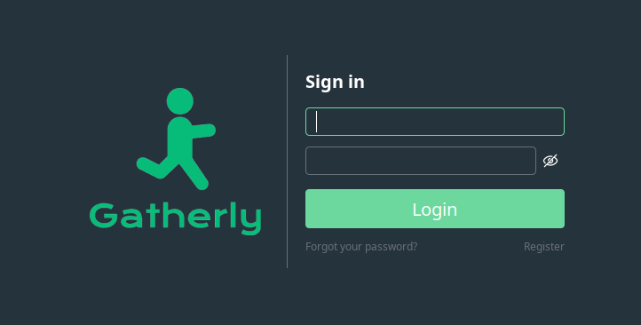

# Java Authentication System

A modern, user-friendly authentication system built with Java Swing and MySQL. This application features a clean, responsive UI with custom components and provides complete user management functionality including registration, login, profile viewing, and profile editing.

## Screenshots

### Sign In Page


### Sign Up Page


### Home Page


### View Details Page


### Edit Details Page


## Features

- **User Authentication**
  - Secure user registration with username uniqueness validation
  - Login functionality with credential verification
  - Password visibility toggle for better user experience
  
- **User Profile Management**
  - View user profile details (username, full name, address)
  - Edit and update profile information
  - Real-time data synchronization with database

- **Modern UI/UX**
  - Responsive design that adapts to different screen sizes
  - Custom rounded buttons with hover effects
  - Themed color scheme with intuitive navigation
  - Focus-aware input fields with visual feedback
  - Smooth page transitions

- **Security Features**
  - Password field masking
  - SQL injection prevention using PreparedStatements
  - Constraint-based username uniqueness enforcement

## Technology Stack

- **Language:** Java
- **GUI Framework:** Swing
- **Database:** MySQL
- **JDBC Driver:** MySQL Connector/J
- **Build Tool:** N/A (Compiled manually with javac)

## Prerequisites

Before running this application, ensure you have the following installed:

- **Java Development Kit (JDK)** 8 or higher
  ```bash
  java -version
  ```

- **MySQL Server** 5.7 or higher
  ```bash
  mysql --version
  ```

- **MySQL Connector/J** (JDBC Driver)
  - Download from: https://dev.mysql.com/downloads/connector/j/
  - Place the JAR file in the `libs/` directory

## Database Setup

### 1. Create Database

First, log into MySQL as root or a user with database creation privileges:

```bash
mysql -u root -p
```

Then execute the following SQL commands:

```sql
-- Create the database
CREATE DATABASE JavaDbExample;

-- Use the database
USE JavaDbExample;

-- Create users table
CREATE TABLE users (
    id INT AUTO_INCREMENT PRIMARY KEY,
    username VARCHAR(50) NOT NULL UNIQUE,
    fullname VARCHAR(100) NOT NULL,
    password VARCHAR(255) NOT NULL,
    address VARCHAR(255),
    created_at TIMESTAMP DEFAULT CURRENT_TIMESTAMP,
    updated_at TIMESTAMP DEFAULT CURRENT_TIMESTAMP ON UPDATE CURRENT_TIMESTAMP
);

-- Create index on username for faster lookups
CREATE INDEX idx_username ON users(username);
```

### 2. Create MySQL User (Optional but Recommended)

For better security, create a dedicated MySQL user for this application:

```sql
-- Create a new user
CREATE USER 'hirdaya'@'localhost' IDENTIFIED BY 'haha';

-- Grant privileges on the database
GRANT ALL PRIVILEGES ON JavaDbExample.* TO 'hirdaya'@'localhost';

-- Apply changes
FLUSH PRIVILEGES;
```

**Note:** Update the credentials in `db/DBConnection.java` if you use different username/password:

```java
private static final String USER = "your_username";
private static final String PASSWORD = "your_password";
```

### 3. Verify Database Setup

```sql
-- Show tables
SHOW TABLES;

-- Describe users table structure
DESCRIBE users;
```

Expected output:
```
+------------+--------------+------+-----+-------------------+-------------------+
| Field      | Type         | Null | Key | Default           | Extra             |
+------------+--------------+------+-----+-------------------+-------------------+
| id         | int          | NO   | PRI | NULL              | auto_increment    |
| username   | varchar(50)  | NO   | UNI | NULL              |                   |
| fullname   | varchar(100) | NO   |     | NULL              |                   |
| password   | varchar(255) | NO   |     | NULL              |                   |
| address    | varchar(255) | YES  |     | NULL              |                   |
| created_at | timestamp    | YES  |     | CURRENT_TIMESTAMP | DEFAULT_GENERATED |
| updated_at | timestamp    | YES  |     | CURRENT_TIMESTAMP | DEFAULT_GENERATED |
+------------+--------------+------+-----+-------------------+-------------------+
```

## Installation and Setup

### 1. Clone or Download the Project

```bash
cd /path/to/your/projects
git clone <repository-url>
cd authentication
```

### 2. Configure Database Connection

Edit `db/DBConnection.java` and update the database credentials:

```java
private static final String URL = "jdbc:mysql://localhost:3306/JavaDbExample";
private static final String USER = "your_mysql_username";
private static final String PASSWORD = "your_mysql_password";
```

### 3. Add MySQL Connector JAR

Place the MySQL Connector/J JAR file in the `libs/` directory:

```bash
mkdir -p libs
cp /path/to/mysql-connector-java-x.x.xx.jar libs/
```

### 4. Compile the Project

```bash
# Compile all Java files
javac -cp ".:libs/*" -d . Main.java db/*.java pages/*.java utils/*.java

# On Windows, use semicolon as classpath separator
javac -cp ".;libs/*" -d . Main.java db/*.java pages/*.java utils/*.java
```

### 5. Run the Application

```bash
# On Linux/Mac
java -cp ".:libs/*" Main

# On Windows
java -cp ".;libs/*" Main
```

## Usage

### First Time Setup

1. **Launch the Application**
   - Run the application using the command above
   - The Sign In page will appear

2. **Create an Account**
   - Click on the "Register" link at the bottom of the Sign In page
   - Fill in your desired username, full name, and password
   - Click the "Register" button
   - You'll be redirected to the Sign In page upon successful registration

3. **Sign In**
   - Enter your username and password
   - Click the "Login" button or press Enter
   - You'll be redirected to the Home page

### Main Features

#### Home Page
- View welcome message with your username
- Access to View Details, Edit Details, and Logout options
- See your last login timestamp

#### View Details
- View your complete profile information
- See username, full name, and address
- Quick access to edit profile

#### Edit Details
- Update your full name
- Add or modify your address
- Save changes to the database

#### Logout
- Click the Logout button
- Confirm the logout action
- Return to Sign In page

## Project Structure

```
authentication/
├── Main.java                   # Application entry point
├── db/
│   └── DBConnection.java       # Database connection manager
├── pages/
│   ├── ApplicationFrame.java   # Main application window
│   ├── SigninPage.java         # Login page
│   ├── SignupPage.java         # Registration page
│   ├── HomePage.java           # Dashboard after login
│   ├── ViewDetailsPage.java    # Profile viewing page
│   ├── EditDetailsPage.java    # Profile editing page
│   ├── NavigationManager.java  # Page navigation interface
│   ├── ResponsivePageBase.java # Base class for responsive pages
│   └── ThemeManager.java       # UI theme configuration
├── utils/
│   ├── HyperlinkText.java      # Clickable hyperlink component
│   ├── PasswordVisibilityToggle.java  # Show/hide password button
│   ├── RoundedButton.java      # Custom rounded button component
│   ├── TextFieldPassword.java  # Custom password input field
│   ├── TextFieldUsername.java  # Custom text input field
│   └── UIUtils.java            # UI constants and utilities
├── libs/
│   └── mysql-connector-java-*.jar  # MySQL JDBC driver
├── demo/
│   ├── ss0.png                 # Sign in screenshot
│   ├── ss1.png                 # Sign up screenshot
│   ├── ss2.png                 # Home page screenshot
│   ├── ss3.png                 # View details screenshot
│   └── ss4.png                 # Edit details screenshot
└── resources/                  # Additional resources (if any)
```

## Security Considerations

⚠️ **Important Security Notes:**

1. **Password Storage:** This application currently stores passwords in plain text. For production use, implement password hashing using BCrypt or similar:
   ```java
   // Use BCrypt for password hashing
   String hashedPassword = BCrypt.hashpw(password, BCrypt.gensalt());
   ```

2. **Database Credentials:** Never commit database credentials to version control. Use environment variables or configuration files:
   ```java
   private static final String USER = System.getenv("DB_USER");
   private static final String PASSWORD = System.getenv("DB_PASSWORD");
   ```

3. **SQL Injection:** The application uses PreparedStatements to prevent SQL injection attacks (✓ Already implemented)

4. **Input Validation:** Add additional validation for email formats, password strength, etc.

## Troubleshooting

### Common Issues

1. **ClassNotFoundException: com.mysql.cj.jdbc.Driver**
   - Ensure MySQL Connector JAR is in the `libs/` directory
   - Check the classpath when running: `java -cp ".:libs/*" Main`

2. **SQLException: Access denied for user**
   - Verify database credentials in `DBConnection.java`
   - Ensure MySQL user has proper privileges
   - Check if MySQL server is running: `sudo systemctl status mysql`

3. **SQLException: Unknown database 'JavaDbExample'**
   - Run the database creation SQL commands
   - Verify database exists: `SHOW DATABASES;`

4. **Compilation Errors**
   - Ensure JDK is properly installed
   - Check all source files are present
   - Verify package structure matches directory structure

## Future Enhancements

- [ ] Implement password hashing (BCrypt/Argon2)
- [ ] Add email verification functionality
- [ ] Implement "Forgot Password" feature
- [ ] Add profile picture upload
- [ ] Implement session management with timeout
- [ ] Add input validation for email and phone numbers
- [ ] Create admin panel for user management
- [ ] Add logging functionality
- [ ] Implement dark/light theme toggle
- [ ] Add export user data functionality

## Contributing

Contributions are welcome! Please follow these steps:

1. Fork the repository
2. Create a feature branch (`git checkout -b feature/AmazingFeature`)
3. Commit your changes (`git commit -m 'Add some AmazingFeature'`)
4. Push to the branch (`git push origin feature/AmazingFeature`)
5. Open a Pull Request

## License

This project is open source and available under the [MIT License](LICENSE).

## Author

**Hirdaya Shrestha**

## Acknowledgments

- Java Swing documentation
- MySQL documentation
- Stack Overflow community

---

**Note:** This is a demonstration project for learning purposes. For production use, please implement proper security measures including password hashing, HTTPS, session management, and regular security audits.
